# Electrum guide

## This is a guide for creating a 2 of 3 multisig wallet with FullyNoded 2 and Electrum

### 1. Create a multisig wallet in FN2

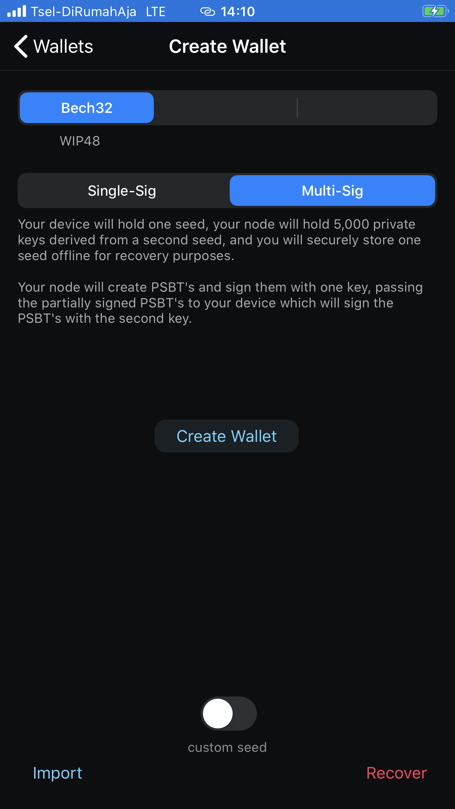

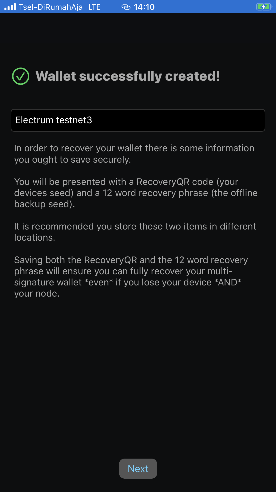

### 2. Save your recovery words, you will need them

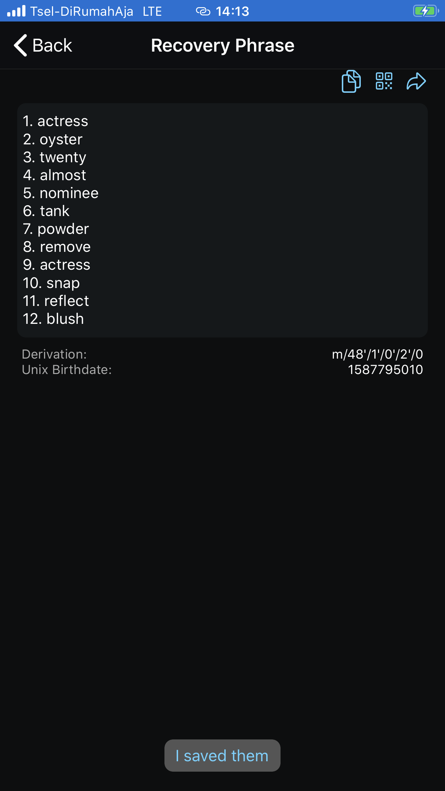

### 3. Open Electrum and create a new mutlisig wallet

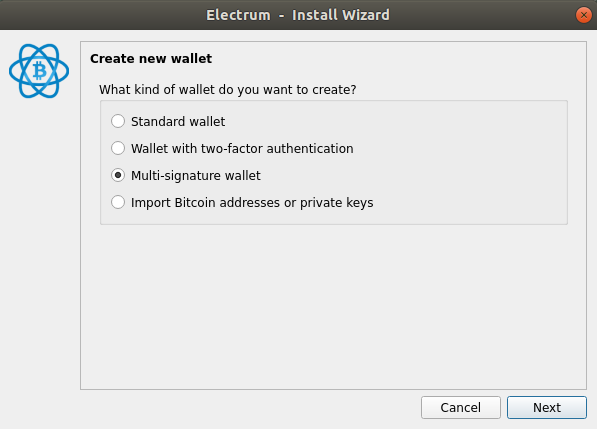

### 4. Choose a 2 of 3

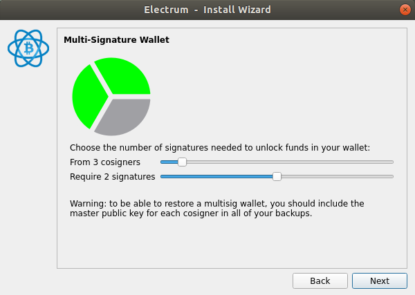

### 5. Import your own seed (the recovery phrase from FN2)

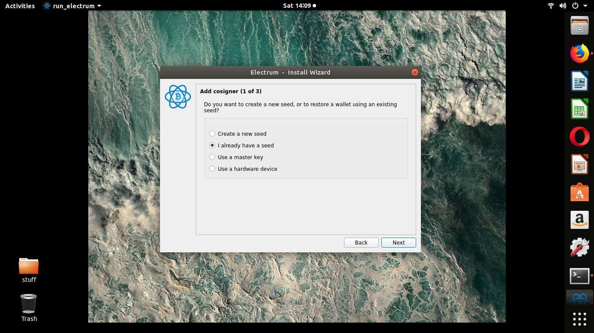

### 6. Its a bip39 seed

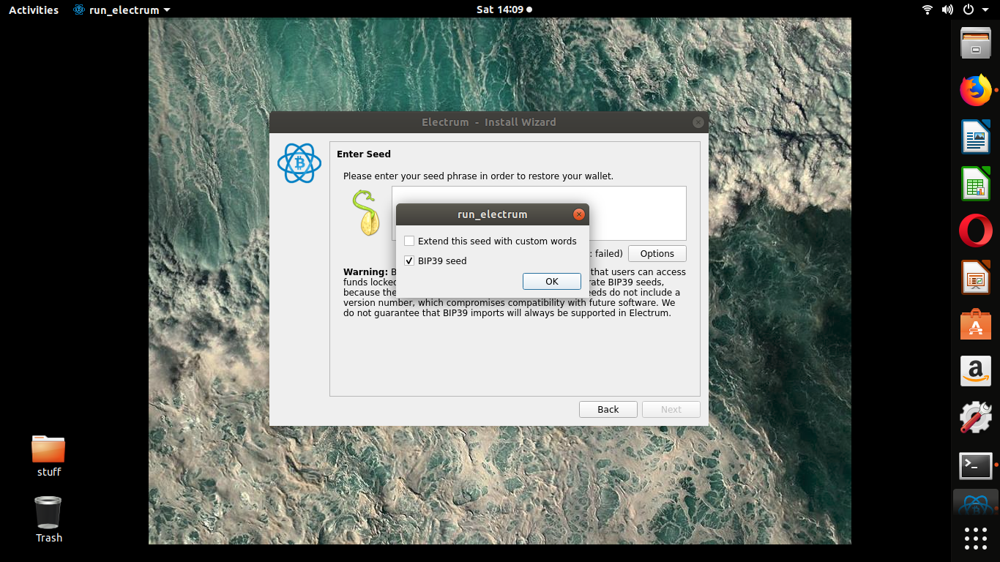

### 7. Add it

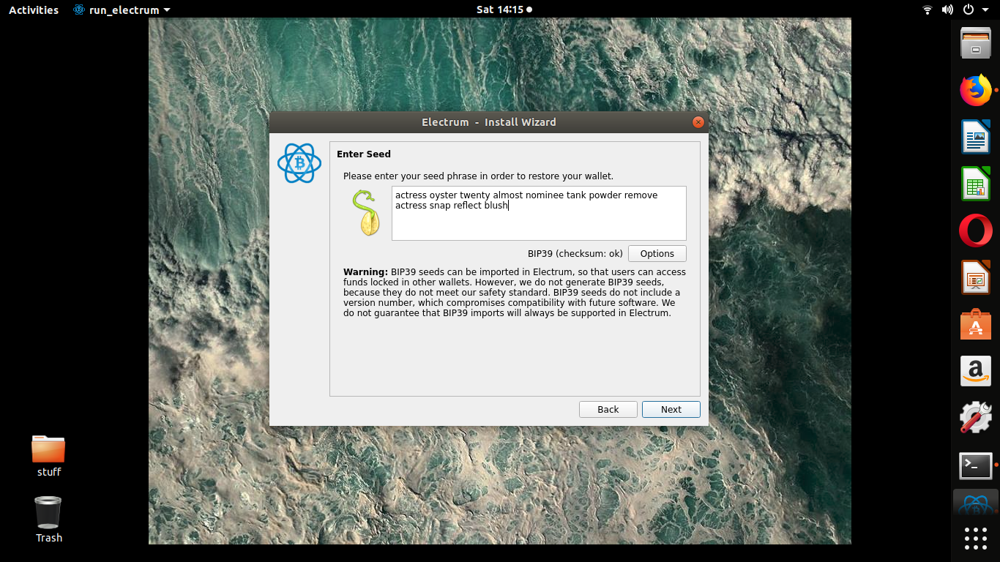

### 8. Confirm derivation - by default FN2 uses the same derivation as Electrum for multisig wallets, just make sure you select `native segwit multisig (p2wsh)`, this is also the default multisig address format used by FN2 (bech32)

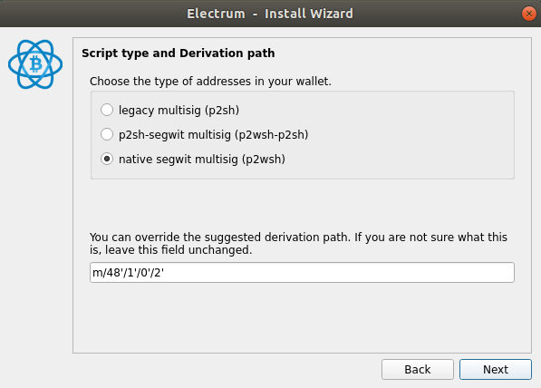

### 9. Electrum derives the extended public key for you to export which is derived from the recovery phrase you just added

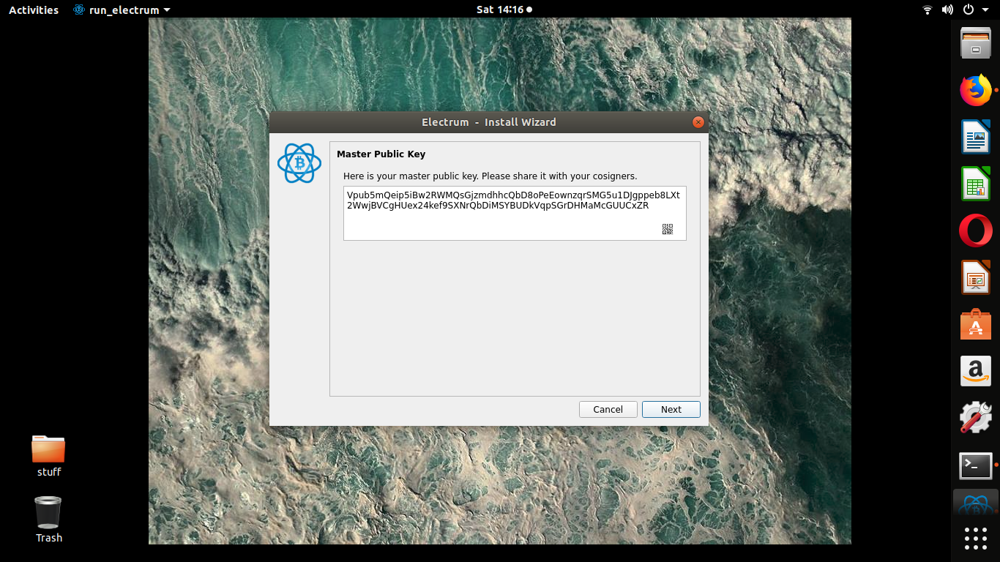

### 10. Enter cosigner #2

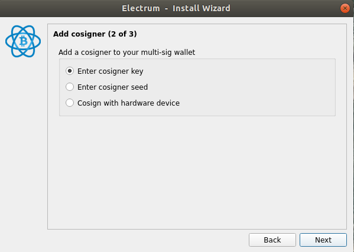

### 11. Come back to FN2 and export your 1st public key descriptor which holds all the xpubs you need

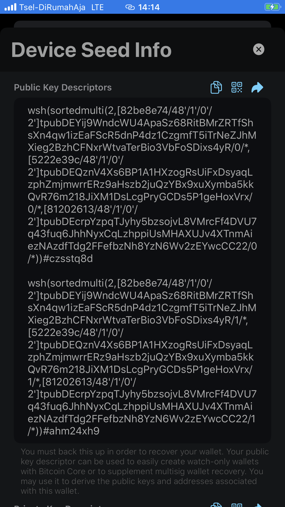

When you export a public key descriptor from FN2 you will get two descriptors, the first one represents your primary addresses and the second descriptor represents your change addresses. The first one is what we need and will look like this:

```
wsh(sortedmulti(2,[82be8e74/48'/1'/0'/2']tpubDEYij9WndcWU4ApaSz68RitBMrZRTfShsXn4qw1izEaFScR5dnP4dz1CzgmfT5iTrNeZJhMXieg2BzhCFNxrWtvaTerBio3VbFoSDixs4yR/0/*,[5222e39c/48'/1'/0'/2']tpubDEQznV4Xs6BP1A1HXzogRsUiFxDsyaqLzphZmjmwrrERz9aHszb2juQzYBx9xuXymba5kkQvR76m218JiXM1DsLcgPryGCDs5P1geHoxVrx/0/*,[81202613/48'/1'/0'/2']tpubDEcrpYzpqTJyhy5bzsojvL8VMrcFf4DVU7q43fuq6JhhNyxCqLzhppiUsMHAXUJv4XTnmAiezNAzdfTdg2FFefbzNh8YzN6Wv2zEYwcCC22/0/*))#czsstq8d
```

It gives you 3 xpubs (tpubs for testnet):

**FullyNoded 2 works with Bitcoin Core and Bitcoin Core only works with xpubs/tpubs. Therefore you will need to use [this tool](https://jlopp.github.io/xpub-converter/) to convert your xpubs to the format Electrum accepts.**

#### xpub #1 always represents your offline recovery keys - this is the one we already imported into Electrum via the offline recovery words. `tpubDEYij9WndcWU4ApaSz68RitBMrZRTfShsXn4qw1izEaFScR5dnP4dz1CzgmfT5iTrNeZJhMXieg2BzhCFNxrWtvaTerBio3VbFoSDixs4yR`

#### xpub #2 always represents your devices keys and will be the one we add into Electrum next. `tpubDDxd7u6V76WHV6CRy3KSsJoXiioVwubYDubysMkvkYuCTFPwWfUwcnC7yh1mNkMd13Ssh8Fu7UiSJRoELuKW58zrVBd1YRGfHkcF2s9DHz3`

#### xpub #3  always represents your nodes keys and will be the final key we add as a cosigner into Electrum. `tpubDFW7MhUGfWLHXafXcca9ow5jUkLukcxawpG7V6BzXgtsxHdkUKuSy5eXwrDZ7zr5jLHRmYnJoHv4GGAYY4HGK53x9BL2tDeePw4QNdkk6Gw`

Here's what it means (you do not need to know but it is useful to understand):

- `wsh`: witness script hash. multisig sig bech32 address type, aka p2wsh (pay to witness script hash). It tells our node that this is a bech32 multisig address type.
- `sortedmulti`: this means the descriptor is describing a BIP67 multisig wallet which means the order of the public keys does not matter as they will always be derived lexicographically.
- `2`: represents the number of signatures required, it is folllowed by the xpubs, the number of xpubs denote the number of possible cosigners, in this case its a 2 of 3.
- `[48214714/48'/1'/0'/2']`: You can think of the xpub as representing this derivation path.
- `/0/*` represents the addresses that the descriptor would import, in this case its the primary addesses. The `*` just means it can import any range of keys making it HD.
- `#9650s8vz`: this is the descriptors checksum

### 13. Take your #2 tpub from the primary descriptor and convert it to a Vpub (for testnet)

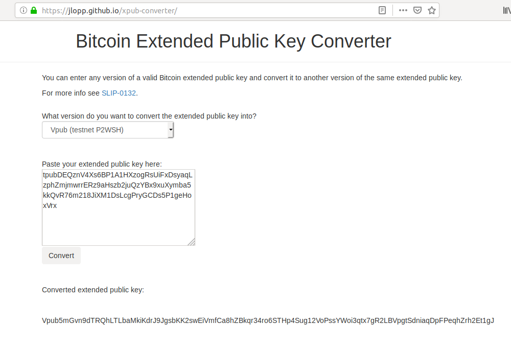


### 14. Paste it in to Electrum, tap next, repeat the process for the third and final xpup/tpub

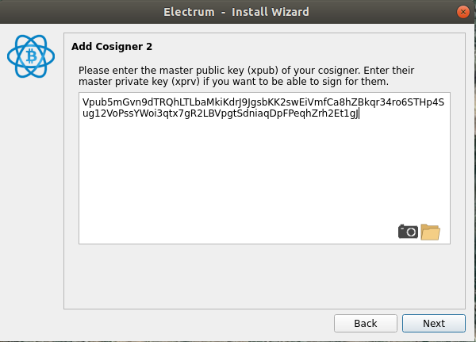

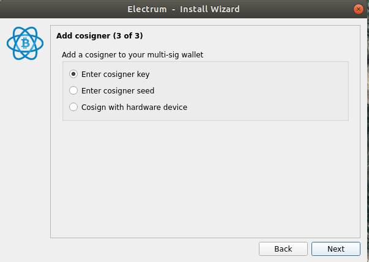

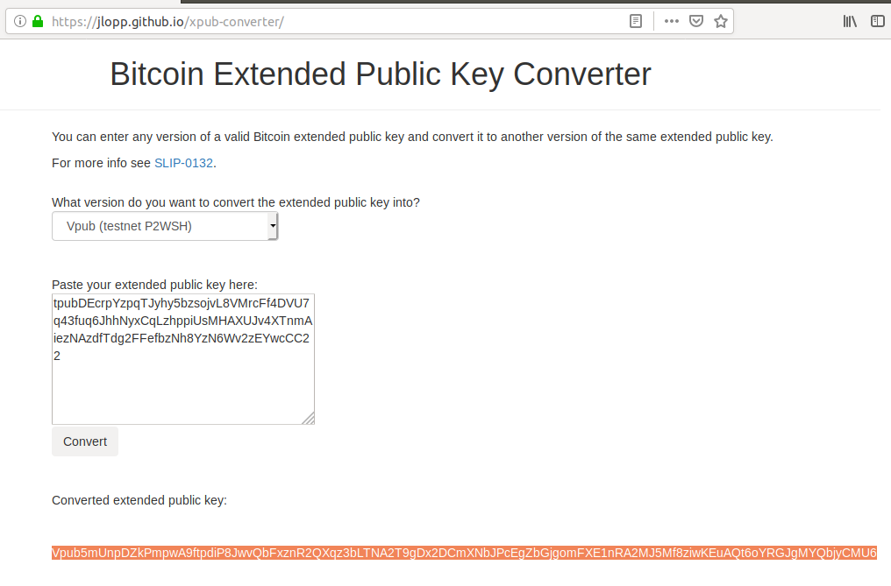

### 15. Bypass Electrums encryption (the nice thing about multisig is we don't need passphrases to maintain security)


### 16. In Electrum export your addesses by tapping "view" -> "addresses" 

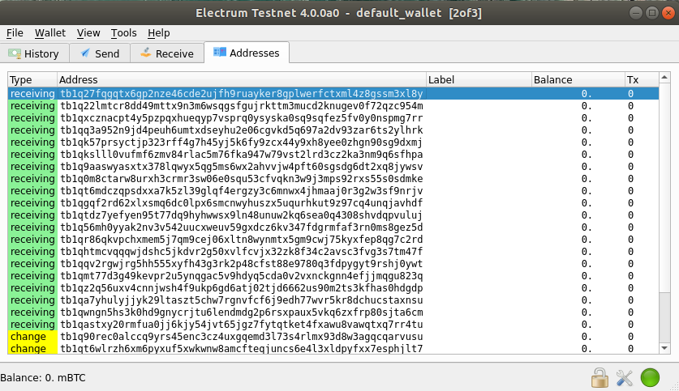

### 17. Open FN2 and go to the Electrum wallet in the wallets tab, tap the eye button to export your multisig keys. 

**Confirm the addresses match what Electrum produced! If they do not then something went wrong! Most likely you selected the wrong derivation type, added the incorrect xpub or converted the xpub to the incorrect format. This does work so try again and be careful to follow the instruction.**

Here we can see the addresses match what Electrum exported 🤩


### 18. Now the good part, use Electrum to receive some testnet bitcoins.

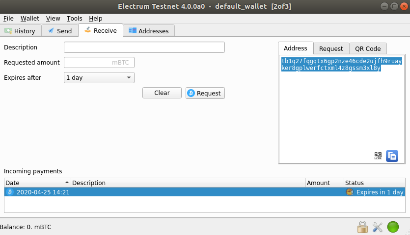

### 19. Confirm you received them - you can do this in both FN2 and Electrum

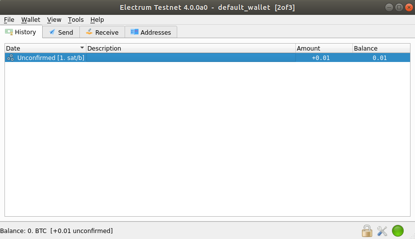

### 20. In Electrum create a PSBT

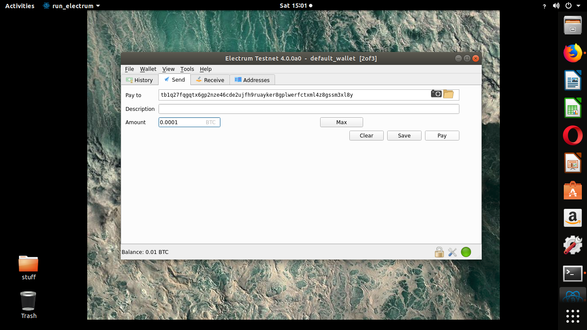

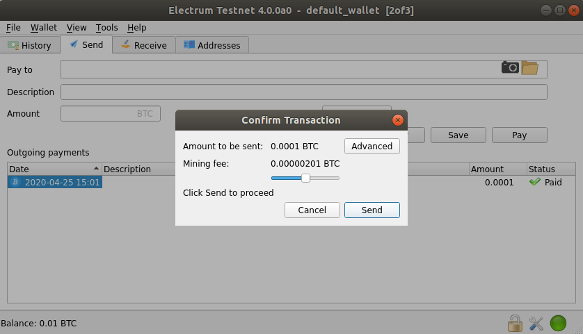

**The following functionality is only available on Electrum if you build the master branch from source. Hopefully it will be avilable for download soon. You can still create the multisig wallets on Electrum but you won't be able to easily pass PSBT's from Electrum to any third party app.** 

### Export the PSBT by clicking "export" in the bottom left -> "export to file". Take that file and send it to your iPhone, saving it in the "Files" app on your iPhone.

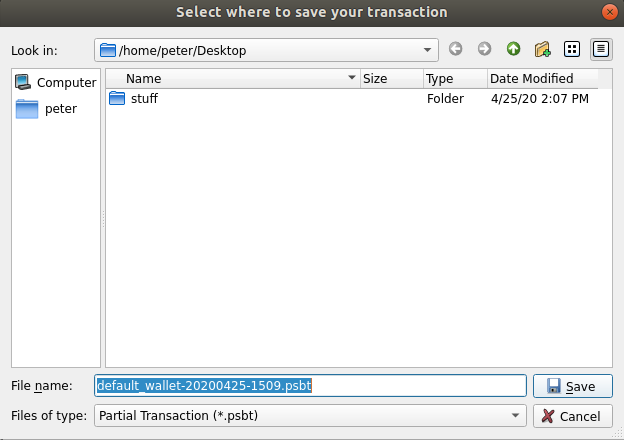

### 21. Open FN2


### 22. Tap the folder icon in top left and tap the .psbt file you exported


### 23. Tap sign


### 24. FN2 will first pass it to your node for processing and signing, then FN2 will sign it locally with the seed that is on the device. It actually loops through all the seeds on your device and signs it if it can. Your current active node in FN2 must be on the same network as the transaction your trying to sign or it will fail.


### 25. At this point the psbt may still need more signatures or may be fully signed. If it is complete it finalizes it, converts it to a signed raw transaction and parses each input and output and displays the fee for you to confirm before broadcasting. If it is incomplete it will allow you to export the updated psbt as raw data file like the one we imported or as base64 hex so that you can pass the psbt to another signer.


### 26. Broadcast it


### 27. Open Electrum and you will see the transaction in your history and of course also in FN2 🤯

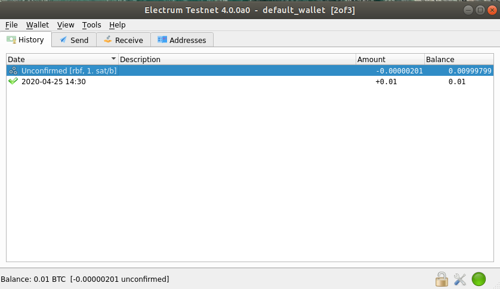


