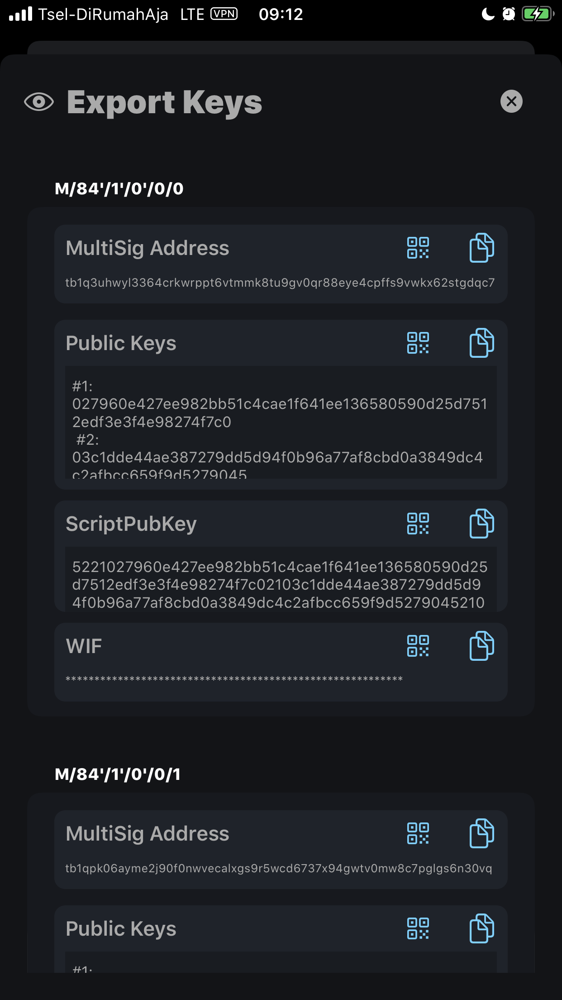

# FullyNoded 2 Features & General Use

## Using FullyNoded 2

### Adding a Node


When initially starting up FullyNoded 2, a user may choose to connect to their own node by scanning a [QuickConnect QR](https://github.com/BlockchainCommons/Bitcoin-Standup#quick-connect-url-using-btcstandup) or link to a testnet node that we are currently utilizing for development purposes by tapping the "don't have a node?" button.

### Creating a Wallet

Once you are connected to a node, you may go to the "Wallets" tab and create either a single-sig or multi-sig wallet:

  

Once the wallet is successfully created on your node you will be guided through a confirmation flow. You will first need to give your wallet a label, so that you can easily recognize it. Note that this label is included in the Recovery QR, so if you use the Recovery QR to recover the wallet the label will persist! 

Please save the recovery items in order to be able to recover your wallet! If you do not do this you are at risk of permanently losing your funds. Simple tap the recovery QR to export it and save it. It should not be saved onto your device, as the whole point is that you will need it if you lose your device. We recommend printing it on waterproof paper and saving it in multiple secure locations.

 

 

The final screen in the wallet created confirmation flow is the offline recovery words. From that screen, you can copy the words to clipboard, export them, or display them in QR code format. It is extremely important for multi-sig wallets that the recovery words are saved; for single-sig wallets, that is redundant to the Recovery QR. It is recommended you write these down on waterproof paper and save them securely in multiple locations. For multi-sig wallets they are required for wallet recovery and refilling the keypool. 

### Accessing a Wallet

   

 

After creating a wallet, you will see it on the "Wallets" page. Tap it to activate it. 

* Tap the info button to display and export your device's seed info and the Recovery QR at anytime. You will always be prompted for 2FA whenever you export a seed or a private key. 
* Tap the eyeball to export all the keys associated with the wallet. These keys will be derived from the device if possible. 
* Tap the verify button to fetch the addresses purely from your node so you may "verify" that the addresses your device derives are the same as the one your node derives. For now LibWally will not derive BIP44/49 multi-sig addresses. These addresses must be fetched from your node. BIP84 multi-sig addresses will be derived locally using LibWally. 
* Tap the list button to see the wallet's UTXOs. This fetches your wallet's UTXOs from your node. From your node's perspective the UTXOs are always watch-only, as your node is never holding enough private keys to fully spend one of them. You may tap each utxo to see all the info in JSON format that your node holds for that UTXO.

### Receiving Funds


To receive funds, activate the wallet you want to receive from and then tap the "In" tab. This will fetch a receiving address from your node for your active wallet. To fetch another one, tap the refresh button in the top right corner. The "amount" and "label" field conform to BIP21: you can add amounts and a label so the spender can simply scan the QR and it will automatically populate the amount field on their end if their software is BIP21 compatible.

### Spending Funds

 

To send funds, just tap the "Out" tab. From here you can tap the scanner button to scan a BIP21 compatible QR code or an address. You can also tap the + button to add multiple outputs to your transaction (batching). Whenever you are ready to build the transaction just tap "next".

### Getting Info from the Home screen

 

You may expand the cells to show more info about your Tor connection, node statistics, and your wallet by tapping the expand/collapse buttons.

You can see all the details associated with your wallet along with transaction history. You will see an ⚠︎ icon for any unconfirmed balances and their associated transactions. You can tap the refresh buttons to reload individual sections or pull the screen to reload all sections.

It is worth noting that the three panes in a multi-sig wallet are communicating the wallets derivation scheme and what is held by the device, node, and offline backup. Your device holds the seed so it can sign for any key, but your node holds a very specific range of keys; here we show you the current wallet index and the maximum index range. Whenever your wallet's current index reaches 100 keys from the maximum range imported into your node, you will automatically be notified and prompted to refill the keypool. It should be noted that you can refill the keypool at anytime.

### Recovering a Wallet

Please see [Recovery.md](./Docs/Recovery.md) for full details of how this works.

You may either input the offline recovery words or the Recovery QR code to recover wallets.

You may input the words one at a time or all at once; once the mnemonic is verified to be valid you will get an alert.

Similarly, upon scanning a valid Recovery QR you will also be alerted.

The "scan Recovery QR" button will also display that the QR was valid after scanning.

Depending on what you are recovering you may "Tap to Recover" once a valid QR and/or words are added.

   

Upon tapping "Tap to recover" you will be presented with a "Recovery Confirmation" screen.

If you used a Recovery QR *FN2* will be able to display all of the wallet's meta data to you for confirmation. If the wallet still exists on your node, it will also be able to fetch the balance. if you are only using words *FN2* will only be able to fetch the wallet name, addresses, and derivation type.

The important part of this page is that it displays the first five addresses derived from the seed. If you you know what addresses to expectm you can verify that they match here.

Upon tapping "Confirm", the wallet will be added and the node will rescan the blockchain automatically to ensure your balances show up.

## How does FullyNoded 2 work?

*FullyNoded 2* operates in tandem with your node, for every wallet you create with *FN2* a corresponding wallet.dat file will be created on your node using the `bitcoin-cli createwallet` command. Wallets will not be saved locally to your device until it is 100% confirmed that the wallet and its keys were successfully imported into your node.

### Wallet creation

*FN2* is currently capable of creating two core wallet types. Single-sig and a 2 of 3 multi-sig.

*FN2* will create a wallet with the following commands:

#### Single-sig wallets

`bitcoin-cli createwallet <your wallets name>, true, true, "", true`

#### Multi-sig wallets

`bitcoin-cli createwallet <your wallets name>, false, true, "", true`

From the Bitcoin Core v0.19.1 help for `createwallet`:

```
Arguments:
1. wallet_name             (string, required) The name for the new wallet. If this is a path, the wallet will be created at the path location.
2. disable_private_keys    (boolean, optional, default=false) Disable the possibility of private keys (only watchonlys are possible in this mode).
3. blank                   (boolean, optional, default=false) Create a blank wallet. A blank wallet has no keys or HD seed. One can be set using sethdseed.
4. passphrase              (string) Encrypt the wallet with this passphrase.
5. avoid_reuse             (boolean, optional, default=false) Keep track of coin reuse, and treat dirty and clean coins differently with privacy considerations in mind.
```

- 1. `<your wallets name>`: a SHA256 hash of your wallets public key descriptor. You can think of your public key descriptor as a unique fingerprint for your wallet, no two will ever be the same. This means we can name wallets deterministically based on the descriptor which holds all the information necessary to derive your wallets addresses. When you go to recover a wallet *FN2* will first create your descriptor and get its hash to see if the wallet already exists on your node or not.

- 2. `true` or `false`: the first boolean lets our node know that we want to create the wallet with `disable_private_keys` set to true for single-sig wallets and `false` for multi-sig wallets. In the single-sig wallet your node never holds any private keys at all. For multi-sig wallets it is a signer and holds 5,000 private keys derived from your nodes designated seed.

- 3. `true`: the second boolean lets our node know that we want the wallet to be created with a blank keypool so that *FN2* is 100% in control over which keys the node's wallet "knows about".

- 4. `""`: the fourth argument as an empty string tells the node that we do not want to encrypt the wallet with a passphrase. This can be done at a later time by the user if desired. If you do encrypt your wallet you will need to decrypt it before *FN2* will be able to function normally.

- 5. `true`: the fifth and final boolean argument is lets your node know that we want to avoid reusing any addresses as it is a best practice. *FN2* is smart enough to do this on its own but as your wallet also "exists" on your node you do always have the option of using this wallet without *FN2* at all. Which is why we take extra precautions to avoid any risk of address reuse.

### Key creation

Before we ever create the wallet on your node *FN2* will first create the seeds locally on the device using your devices cryptographically secure random number generator.

For single-sig wallets a single seed is created, encrypted and stored locally.

For multi-sig wallets three seeds are initially created.

- 1. The first seed is designated as your offline recovery phrase and converted into a 12 word BIP39 mnemonic which you are responsible for storing offline. This mnemonic *must* be saved and used in order to refill your node's wallet's keypool and to recover the wallet if you lose your node or delete the wallet from the node somehow. Once you go through the wallet created confirmation flow the offline seed will be deleted from the device forever, it is never stored on the device's database, it is displayed temporarily to give you a chance to save it, then deleted forever.

- 2. The second seed is designated as your device's seed and is securely encrypted and stored locally. This seed may be exported at any time along with the Recovery QR code which itself holds this seed.

- 3. The third seed is designated for the node. It is converted to an `xprv` then the seed itself is deleted forever. It is never stored to the devices database.

At this stage the device is fully capable of signing transactions for the wallet. In order for the node to be able to sign transactions or create PSBT's we need to import keys into it.

### Key importing

#### Multi-sig wallets

For multi-sig wallets the device converts seed #1 and #2 to xpub's and seed #3 to an xprv. *FN2* then constructs a descriptor which for a BIP84 wallet would look like this:

```
"wsh(multi(2,[10c791f9/84'/1'/0']tpubDCDH16GTAZQojSwiTbDsjJLf5GqCHacQQvG4A1rgJiH5bVwkyhcALaZbFdAoYzJDuL5p1z4uJw47W57oAMjG7M1FMLzeVvoESXQhcK3iV9a/0/*,[183d7575/84'/1'/0']tpubDCT7BpTfsrYKwtcErnu32pMdsphzCdXJkdECmgnKQeYWvfci2bKN1TGgqGqLCY2ciT4VcRymqvZJnLrCyiqZryzYhcT5RCZTt5kPEEZv3vu/0/*,[f7fa2687/84'/1'/0']tprv8ftRxc6xTpRsmi2MVzFhF5NiJiG8vPWGLZyaMZ4Y86VyPSHKYv2PySV9fTg4obY3Gchx7211p5eg7kMrG7ct6gxWYEUUvvxyisHKCZ9vhnX/0/*))"
```
`wsh` represents the address format, in this case "witness script hash".
`multi` represents a multi-sig type descriptor.
`2` represents the number of signatures required to spend from this wallet.
```
[10c791f9/84'/1'/0']tpubDCDH16GTAZQojSwiTbDsjJLf5GqCHacQQvG4A1rgJiH5bVwkyhcALaZbFdAoYzJDuL5p1z4uJw47W57oAMjG7M1FMLzeVvoESXQhcK3iV9a/0/*,[183d7575/84'/1'/0']tpubDCT7BpTfsrYKwtcErnu32pMdsphzCdXJkdECmgnKQeYWvfci2bKN1TGgqGqLCY2ciT4VcRymqvZJnLrCyiqZryzYhcT5RCZTt5kPEEZv3vu/0/*,[f7fa2687/84'/1'/0']tprv8ftRxc6xTpRsmi2MVzFhF5NiJiG8vPWGLZyaMZ4Y86VyPSHKYv2PySV9fTg4obY3Gchx7211p5eg7kMrG7ct6gxWYEUUvvxyisHKCZ9vhnX/0/*
```
The above represents the three extended keys. Notice the final key is an `xprv` and represents the nodes designated seed. The order of these keys is highly significant and it is crucial to note that the order matters very much. For example when we recover multi-sig wallets *FN2* knows the order as described above and will swap out the offline seed's `xpub` for an `xprv` and will swap the node's `xprv` for the `xpub`. If these keys are added in the incorrect order the wallet will create different addresses.
`[10c791f9/84'/1'/0']` this section of the extended key represents the derivation path, where `10c791f9` represents the master key fingerprint for that seed. Altogether we are telling bitcoin core that this extended key is a BIP84 testnet account extended key. The appended `/0/*` denotes the remaining path components with the `*` representing the keys we actually want to derive and import into the node.

Remember when we initially create the wallet with `bitcoin-cli createwallet` we tell the node to create the wallet with a blank keypool.

*FN2* after constructing the above BIP84 testnet multi-sig descriptor will then issue a `bitcoin-cli getdescriptorinfo` command to your node which returns a result such as:

```
Result:
{
  "descriptor" : "desc",         (string) The descriptor in canonical form, without private keys
  "checksum" : "chksum",         (string) The checksum for the input descriptor
  "isrange" : true|false,        (boolean) Whether the descriptor is ranged
  "issolvable" : true|false,     (boolean) Whether the descriptor is solvable
  "hasprivatekeys" : true|false, (boolean) Whether the input descriptor contained at least one private key
}
```

In order to actually import the keys into your node *FN2* then appends the `checksum` to the original descriptor and issues another command `bitcoin-cli importmulti` with the following parameters:

```
[{ "desc": "wsh(multi(2,[10c791f9/84'/1'/0']tpubDCDH16GTAZQojSwiTbDsjJLf5GqCHacQQvG4A1rgJiH5bVwkyhcALaZbFdAoYzJDuL5p1z4uJw47W57oAMjG7M1FMLzeVvoESXQhcK3iV9a/0/*,[183d7575/84'/1'/0']tpubDCT7BpTfsrYKwtcErnu32pMdsphzCdXJkdECmgnKQeYWvfci2bKN1TGgqGqLCY2ciT4VcRymqvZJnLrCyiqZryzYhcT5RCZTt5kPEEZv3vu/0/*,[f7fa2687/84'/1'/0']tprv8ftRxc6xTpRsmi2MVzFhF5NiJiG8vPWGLZyaMZ4Y86VyPSHKYv2PySV9fTg4obY3Gchx7211p5eg7kMrG7ct6gxWYEUUvvxyisHKCZ9vhnX/0/*))#2ctx5x3a", "timestamp": "now", "range": [0,2500], "watchonly": true, "label": "StandUp", "keypool": false, "internal": false }], {"rescan": false}]
```

Once we get a success response from your node that the 2500 primary keys have been imported into your node's wallet we then repeat the above process to also import the BIP84 change keys into the node, that involves changing the path to comply with BIP84/44/49 by changing the appended path `/0/*` to `/1/*`. This requires a second `getdescriptorinfo` command to get the proper checksum and another `importmulti` command with the following parameters to import the change keys into the node:

```
[{ "desc": "wsh(multi(2,[10c791f9/84'/1'/0']tpubDCDH16GTAZQojSwiTbDsjJLf5GqCHacQQvG4A1rgJiH5bVwkyhcALaZbFdAoYzJDuL5p1z4uJw47W57oAMjG7M1FMLzeVvoESXQhcK3iV9a/1/*,[183d7575/84'/1'/0']tpubDCT7BpTfsrYKwtcErnu32pMdsphzCdXJkdECmgnKQeYWvfci2bKN1TGgqGqLCY2ciT4VcRymqvZJnLrCyiqZryzYhcT5RCZTt5kPEEZv3vu/1/*,[f7fa2687/84'/1'/0']tprv8ftRxc6xTpRsmi2MVzFhF5NiJiG8vPWGLZyaMZ4Y86VyPSHKYv2PySV9fTg4obY3Gchx7211p5eg7kMrG7ct6gxWYEUUvvxyisHKCZ9vhnX/1/*))#cdhjhfs7", "timestamp": "now", "range": [0,2500], "watchonly": true, "label": "StandUp", "keypool": false, "internal": false }], {"rescan": false}]
```
Notice the appended path and the checksum are the only differences.

It is worth noting Bitcoin Core does not work especially well with multi-sig wallets which is why we have to set the `keypool` and `internal` arguments to false as your node will not add multi-sig addresses to its keypool. *FN2* picks up the slack here from Bitcoin Core and keeps track of your wallets index so that we can derive primary and change addresses on demand without reusing addresses.

Once the above process completes *FN2* will display a wallet created confirmation screen where you may save the Recovery QR and offline seed. Once you have confirmed to have saved those items you may receive to and spend from the wallet.

#### Single-sig wallets

For single-sig wallets we simply convert your devices seed to an account `xpub` depending on whether it is BIP84/44/49.

We repeat a similar process as above but because it is a single-sig wallet we only import the `xpub` and we can set `keypool` to `true` and `internal` to `true` as well when importing keys. See these two `importmulti` commands as an example for single-sig key importing:

For your primary keys:

```
bitcoin-cli importmulti [{ "desc": "wpkh([6010283d/84'/1'/0']tpubDC9yDKwrjmyBGAdWdhpVn1rtiQR7vgZ4FUzHbC8b1aQTwRBAVtBcon8iaamPGq9NiH2yCV3bLp6ZAWsNntcVYeWBX7fBzTmL2T6f2EcbxDi/0/*)#nv2ykqr0", "timestamp": "now", "range": [0,2500], "watchonly": true, "label": "StandUp", "keypool": true, "internal": false }]
```

For your change keys:

```
bitcoin-cli importmulti [{ "desc": "wpkh([6010283d/84'/1'/0']tpubDC9yDKwrjmyBGAdWdhpVn1rtiQR7vgZ4FUzHbC8b1aQTwRBAVtBcon8iaamPGq9NiH2yCV3bLp6ZAWsNntcVYeWBX7fBzTmL2T6f2EcbxDi/1/*)#zc09t4nh", "timestamp": "now", "range": [0,2500], "watchonly": true, "keypool": true, "internal": true }]
```

Notice this is still a BIP84 derivation but because it is single-sig we use `wpkh` (witness public key hash) instead of its multi-sig equivalent `wsh`. We only import the `xpub` so it is truly a watch-only wallet as far as the node is concerned.

### Receiving

To generate addresses to receieve to in *FN2* we take two approaches, one for each wallet type.

#### Single-sig

For single-sig it is straightforward, we completely rely on your node to handle it as we created the wallet with `avoid_reuse` set to true and the nodes wallet holds the derived keys in its keypool.

It is simply a matter of `bitcoin-cli getnewaddress` with an argument of either `legacy`, `bech32` or `p2sh-segwit` depending on your wallets derivation scheme. It is worth noting your node is capable of producing any address type for the public keys you imported into it. However from *FN2* point of view we specifiy a specific wallet derivation scheme so the user knows exactly what they are dealing with.

#### Mutli-sig

Again as Bitcoin Core is not designed to work especially well with multi-sig *FN2* has to handle some more wallet logic to generate receive addresses. *FN2* makes sure to keep careful track of the last used index, every time you use your wallet or go to the wallets tab *FN2* fetches each wallets UTXO's and checks the UTXO addresses path to ensure the wallet's index property is not set lower then the highest UTXO index. This way you may use the wallet outside of *FN2* and *FN2* will still never reuse a multi-sig address.

When you tap the "In" tab for a multi-sig wallet *FN2* will fetch the wallet last used index and increment it up by one, it will also fetch the wallets public key descriptor and then issue the following command to your node:

```
bitcoin-cli deriveaddresses ["wsh(multi(2,[77b83f20/84'/1'/0']tpubDDM9BgS5v4tKDLQiaQtSkE6W6nLxttAYU7kTjojb7dxm8kV99kmkUn3nPNpovJJAXoiFaAeA4zZWQCjZuU378SvDdVfBigkSJn5Ewtz3pCN/0/*,[dc0e74ad/84'/1'/0']tpubDCqkVqKYk9NWKxT7VxNCyEDETA12wWUDi6qn6rwevojQAxibuzUoowLMcFLaNGhqbrXrfLzkPoN8zRbxuHmGy9zkucJZqY6nraZe5kNY4mX/0/*,[e63243e5/84'/1'/0']tpubDDLDujmVccWCodNZzyqwE1sy5w4NfsrksyvnEU7P22KPJc4jw2epNZ56oUxVCV9rCAUdofcxKqy84iB2NNs1TcUjSZktNNr9qkeg6pbc9Yf/0/*))#097dvlk5", [2520,2520]]
```

Notice the `[2520,2520]`, this is the range where we can tell your node to derive all of these addresses. Since we only want one address to receive to at a time we specify the same index. Every time you generate an address in this way we update your wallet's index. We also always update your wallets' index every time you create a transaction, again we do this to avoid any possibility of reusing the same multi-sig address.

### Spending

For both wallet types *FN2* will utilize the `bitcoin-cli walletcreatefundedpsbt` command.

For multi-sig wallets because Bitcoin Core does not add multi-sig keys to the keypool we need to first fetch a change address in the same way we fetch a receive address. *FN2* also saves your wallets change descriptor and will go ahead and use `deriveaddresses` for your wallets current index + 1 using the change descriptor instead of the primary descriptor.

Once a change address is created we use:

```
bitcoin-cli walletcreatefundedpsbt [[], {"tb1qlesv3vv5zlu6gzha53xhdu4kpzuqr60gxeyhr94jegktj9laxguq5pe49v": 0.0001}, 0, {"includeWatching": true, "replaceable": true, "conf_target": 2, "changeAddress": "tb1qn7lkzrylfyhz9lm6mqnmwlgpavcq7qs9ctxpsyjuaky4zuzr5x2qxrw069"}, true]
```

For single-sig wallets we do not need to specify a change address, instead we simply specify a `change_type` which conforms to the wallet's derivation. We do this because by default bitcoind will use a `p2sh-segwit` format address for change, yet it is important that we keep all the wallets inputs to conform with the wallet derivation scheme. The other difference is when it comes to signing for some reason LibWally has a bug where it will not sign single-sig psbt's, therefore we convert the psbt to an unsigned raw transaction and then sign the transaction locally with the appropriate private key.

- `[]` which is an empty array of inputs tells the node to handle coin selection for us which leverages Bitcoin Core's sophisticated coin selection algorithm. Whenever you itilize the sweep to tool we will simply fetch all of the wallets UTXO's from your node parse them and add them as inputs here
- `{"tb1qlesv3vv5zlu6gzha53xhdu4kpzuqr60gxeyhr94jegktj9laxguq5pe49v": 0.0001}` is our output.
- `0` is our locktime.
- `"includeWatching": true` as our node's wallets are always watch-only.
- `"replaceable": true` to ensure we can use RBF if needed.
- `"conf_target": 2` this represents the mining fee target you can set in *FN2* settings. It tells the node how many blocks we want the transaction to be confirmed in. This allows *FN2* to leverage Bitcoin Core's fee optimization.
- `"changeAddress": "tb1qn7lkzrylfyhz9lm6mqnmwlgpavcq7qs9ctxpsyjuaky4zuzr5x2qxrw069"` here we specify the change address we want to use which was initially fetched before building the `psbt`.

The node will then respond with a `psbt`, *FN2* takes that `psbt` and issues a second command to the node:

```
bitcoin-cli walletprocesspsbt ["cHNidP8BAIkCAAAAAd7uRtRwGBZSW7qrrIlwfxlmKozNGbd9Gy4ZQNeFpd3oAAAAAAD9////AlbBDwAAAAAAIgAgn79hDJ9JLiL/etgnt30B6zAPAgXCzBgSXO2JUXBDoZQQJwAAAAAAACIAIP5gyLGUF/mkCv2kTXbytgi4AenoNklxlrLKLLkX/TI4AAAAAAABASsx6Q8AAAAAACIAIKvuCzMLCyyw70Qm2zY48KG54nH+QQlQMRjg2jdBp5DtAQVpUiECcKUM+E4AR+y7zm2kYeXxJYXd3ytLdrcr6XT+oKXtaZ4hAhvjMJ6ZhLAUXtzrPn7lloCSYiCD7SdEeJb42SqqkTeiIQMnwBac6tHVFuIErUHuvFlFg+cb6yHF4LOgiD+8fF3OolOuIgYCG+MwnpmEsBRe3Os+fuWWgJJiIIPtJ0R4lvjZKqqRN6IY3A50rVQAAIABAACAAAAAgAEAAADRCQAAIgYCcKUM+E4AR+y7zm2kYeXxJYXd3ytLdrcr6XT+oKXtaZ4Yd7g/IFQAAIABAACAAAAAgAEAAADRCQAAIgYDJ8AWnOrR1RbiBK1B7rxZRYPnG+shxeCzoIg/vHxdzqIY5jJD5VQAAIABAACAAAAAgAEAAADRCQAAAAEBaVIhAmPcWcmdikDkPgwK+7NTMy+LgYIdbaGLthKX5sh0bfnhIQMxjckX2OwSv2q2JohrNs62Sq3O8Uff3t71n7DmiCC1EiEDSptrn3vKdwBT5474wGPUuyJsgx1KJ7gWEO9a/lgbM/JTriICAmPcWcmdikDkPgwK+7NTMy+LgYIdbaGLthKX5sh0bfnhGHe4PyBUAACAAQAAgAAAAIABAAAA2QkAACICAzGNyRfY7BK/arYmiGs2zrZKrc7xR9/e3vWfsOaIILUSGNwOdK1UAACAAQAAgAAAAIABAAAA2QkAACICA0qba597yncAU+eO+MBj1LsibIMdSie4FhDvWv5YGzPyGOYyQ+VUAACAAQAAgAAAAIABAAAA2QkAAAABAWlSIQJ4DaqZKYHp4ni9Com5K4fMldgJ7dmfH8hZd2uIiq9jwiEDrqtuo68Jty4mjmFe68AZzogMTviOVFBqqG0EzK1bC1ghAsJGkJTs32gEDxQrThcv/PfQsalhTO8y29JBVSA+iGqWU64iAgJ4DaqZKYHp4ni9Com5K4fMldgJ7dmfH8hZd2uIiq9jwhh3uD8gVAAAgAEAAIAAAACAAAAAANkJAAAiAgLCRpCU7N9oBA8UK04XL/z30LGpYUzvMtvSQVUgPohqlhjmMkPlVAAAgAEAAIAAAACAAAAAANkJAAAiAgOuq26jrwm3LiaOYV7rwBnOiAxO+I5UUGqobQTMrVsLWBjcDnStVAAAgAEAAIAAAACAAAAAANkJAAAA", true, "ALL", true]
```
The `walletprocesspsbt` tells our node to sign the `psbt` if it can, it will then sign and return the partially signed `psbt`. At this point *FN2* will decode the `psbt` to fetch the bip32 path for the inputs. From the input's path we can get the UTXO's address index, from that index we fetch the corresponding private key, the device then signs the `psbt` locally with that private key. At this point the `psbt` should be fully signed.

After the device fully signs the `psbt` we `finalize` it locally using LibWally which converts it from `psbt` format to a raw transaction.

Your node will then decode the signed raw transaction, parse each input, output and calculate the mining fee to be paid by totaling the inputs and outputs, subtracting the total from each other.

This list of inputs/outputs and the mining fee is then displayed to the user for confirmation before being broadcast. *FN2* allows you to tap each input and output, doing this runs the `bitcoin-cli getaddressinfo` command and fetches whatever info the node's wallet knows about the respective address. In this way users can verify without a doubt that the input belongs to them, the change output belongs to them and that the recipient does or doesn't belong to them.

Once the user is happy everything looks good they can tap `broadcast` at which point the node will broadcast the transaction.

It is worth noting the app is fully capable of creating unsigned transactions and if for some reason your node can not sign the transaction of you delete the seed from your device *FN2* will instead create an unsigned transaction and instead of broadcasting it will display a list of options for formatting the unsigned transaction to export to a variety of offline signers such as Coldcard, Hermit etc.

## Wishlist

- [ ] Wallet Functions
  - [x] Offline PSBT signing
  - [x] Offline raw transaction signing
  - [x] Spend and Receive
  - [x] Segwit
  - [x] Non-custodial
  - [ ] Coin Control
  - [x] BIP44
  - [x] BIP84
  - [x] BIP49
  - [x] BIP32
  - [x] BIP21
  - [x] Custom mining fee
  - [x] Multisig
  - [ ] Cold storage
  - [x] Multiwalletrpc

- [ ] Security
  - [x] Seed created with Apple's cryptographically secure random number generator
  - [x] Seed encrypted with a private key stored on the devices keychain which is itself encrypted
  - [x] Seed encrypted with native iOS code
  - [x] Tor V3 Authentication
  - [ ] Passphrase support
  - [ ] Wallet.dat encryption
  - [ ] Disable all networking before importing/exporting seed
  - [ ] Automated Tor authentication
  - [x] 2FA

- [ ] Compatible Nodes
  - [x] Your own Bitcoin Core node
  - [x] MacOS - [StandUp.app](https://github.com/BlockchainCommons/Bitcoin-StandUp-MacOS)
  - [x] Linux - [StandUp.sh](https://github.com/BlockchainCommons/Bitcoin-StandUp-Scripts)
  - [x] Nodl
  - [x] myNode
  - [x] BTCPayServer
  - [x] RaspiBlitz
  - [ ] Wasabi
  - [ ] CasaHodl

