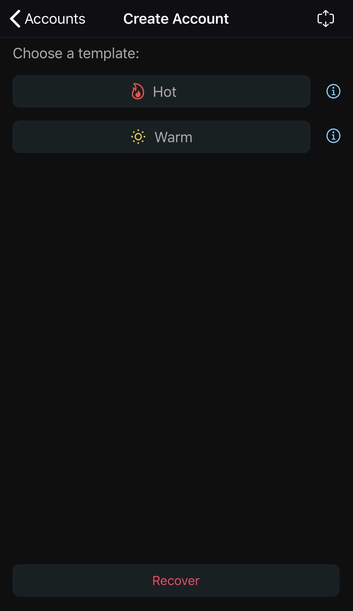
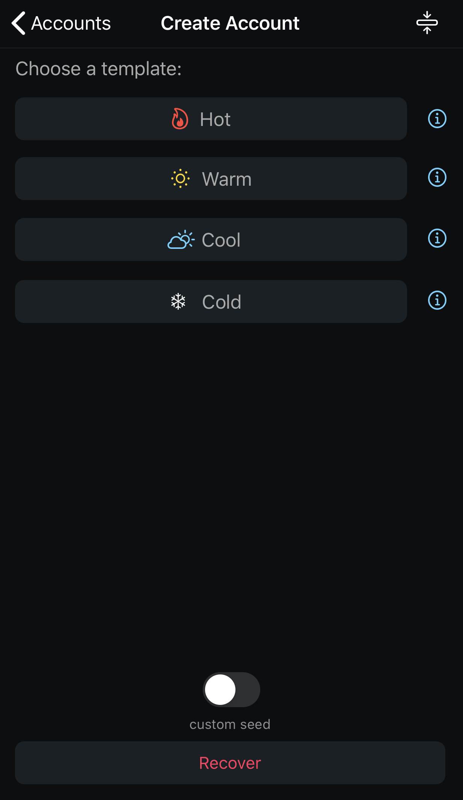
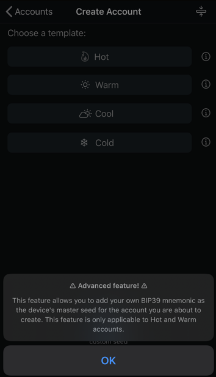
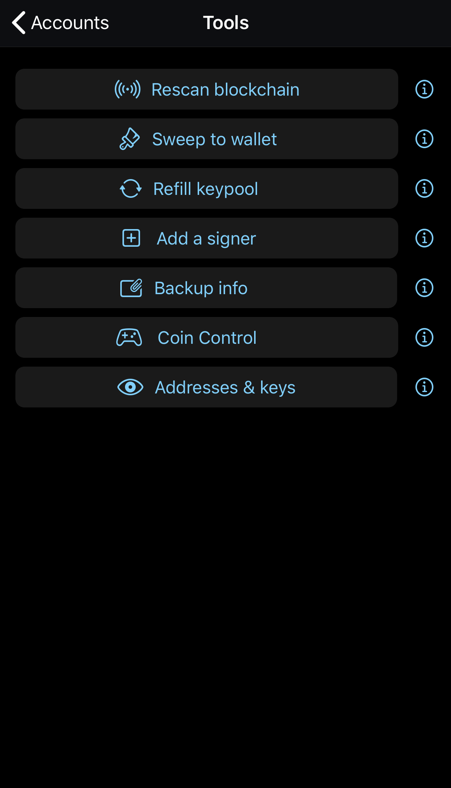
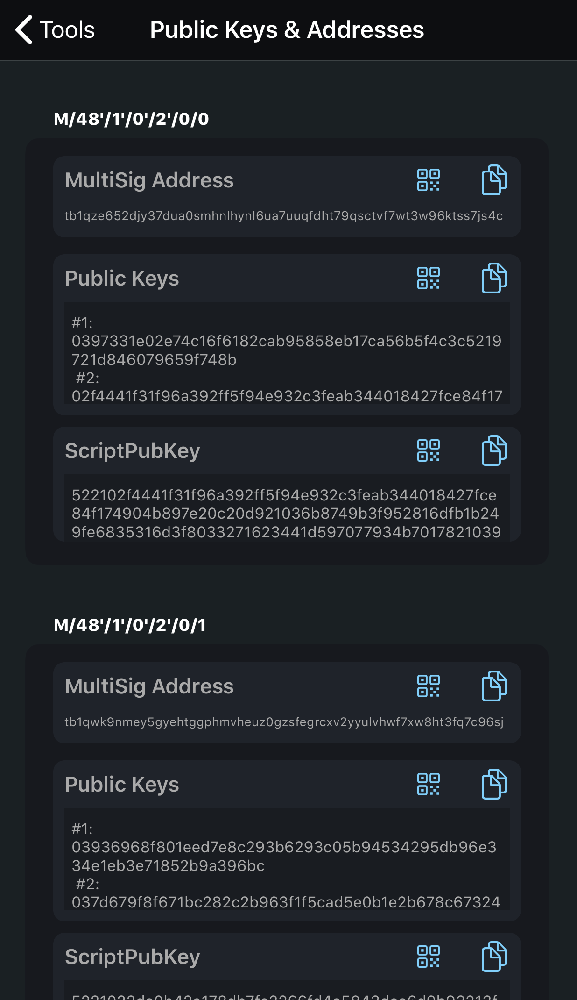
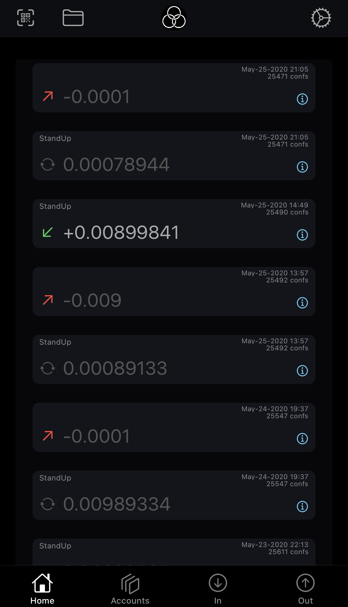

# Using FullyNoded 2

FullyNoded 2 allows you to: add a node; create an account; access accounts; receive funds; spend funds; utilize advanced coin control; export keys; refill your nodes keypool; sweep funds to address; sweep funds to account; recover accounts; import accounts; add signers which are not associated with accounts on the device; sign for any psbt it holds a seed for; Coldcard compatibility; create accounts with xpubs or seed words. Instructions on how to use the basic features follow, as does a wishlist of potential future expansions.

For more information on how these features actually function, see ["How It Works"](How-it-works.md).

## Adding a Node

When initially starting up FullyNoded 2, a user may choose to connect to their own node by scanning a [QuickConnect QR](https://github.com/BlockchainCommons/Bitcoin-Standup#quick-connect-url-using-btcstandup) or link to a testnet node that we are currently utilizing for development purposes by tapping the "don't have a node?" button.

## Creating a account

Once you are connected to a node, you may go to the "Accounts" tab and create either a Hot or Warm account:

A Hot account is a single signature, segwit account that adheres to bip84. The seed words are saved to your device and used to sign transactions, the node gets 2500 receive public keys imported into it and 2500 change public keys.

A Warm account is a 2 of 3, segwit multi-signature account that adheres to bip48. One set of seed words are saved to your device, one seed is used to derive an xprv which is used to derive 2500 receive private keys into your node and 2500 change private keys so that it may be the 2nd signer for the account, with your device being the first signer.

You may expand your account creation options by tapping the expand/collapse button in the top right. Doing so will show more advanced account types and an option to use your own set of seed words to create accounts with.

 

If the custom seed option is toggled on you will be prompted to add it prior to the account being created. That feature is only applicable to Hot and Warm accounts.

Cool account is a 2 of 3 segwit multisig account that adheres to bip48. Your device will only hold xpubs, your node will hold one set of private keys derived from a seed it creates and offers to you for backing up offline. This account type is for advanced users only! The account will not be spendable and external signing software is required to spend from this account type.

Cold account is a single signature segwit account that adheres to bip84. A user supplied account xpub is required along with the master key fingerprint. Again this account type is for advanced users and is not spendable, external offline signing software is required to spend from this account type. You may at anytime add your seed words to the app to make it hot and spendable.

  

Once the account is successfully created on your node you will be guided through a confirmation flow. You will first need to give your account a label, so that you can easily recognize it. Note that this label is included in the Account Map QR, if you use the Account Map QR to recover the account the label will be remembered.

Please save the recovery items in order to be able to recover your account! If you do not do this you are at risk of permanently losing your funds. The Account Map QR only contains public keys and is used to recreate your account as watch-only, in order to make it spendable you need to add your seed words to the account.

The final screen in the account created confirmation flow is the offline recovery words. From that screen, you can copy the words to clipboard, export them, or display them in QR code format. *It is extremely important that the recovery words are saved*. It is recommended you write these down on waterproof paper and save them securely in multiple locations. For multi-sig accounts they are required for account recovery and for refilling the keypool.

## Accessing an Account

 

 

After creating a account, you will see it on the "accounts" page. Tap it to activate it. Once you have activated an account you may tap the tool button in the top right corner to see all account tools. From this menu you have access to many powerful tools.

* "Rescan blockchain" to get options for rescanning the blockchain. This is useful when recovering or importing accounts. You may rescan from birthdate, from genesis, abort rescan or simply check the scan status.
* "Sweep to account" allows you to sweep the current account to any other account.
* "Refill keypool" allows you to add 2500 more receive keys and 2500 more change keys to your node incase you have reached the limit.
* "Add a signer" allows you to add a signer to your account if it is not spendable. The app will verify that your mnemonic matches one of the accounts xpubs before actually adding it. Once added your account type will update in the UI and if enough signers have been added you will be able to spend from it.
* "Backup Info" to display and export your device's seed info and the Account Map QR at anytime. You will always be prompted for 2FA whenever you export a seed or a private key.
* "Coin control" to see the account's UTXOs. This fetches your account's UTXOs from your node and allows you to lock and unlock utxo's to make them (un)spendable.
* "Addresses and keys" to export all the keys associated with the account. These keys will be derived from the device if possible.

## Receiving Funds

To receive funds, activate the account you want to receive from and then tap the "In" tab and then "create". This will fetch a receiving address from your node for your active account. To fetch another one, tap the "create" button again. The "amount" and "label" field conform to BIP21: you can add amounts and a label so the spender can simply scan the QR and it will automatically populate the amount field on their end if their software is BIP21 compatible.

## Spending Funds

 

To send funds, just tap the "Out" tab. From here you can tap the scanner button to scan a BIP21 compatible QR code or an address. You can also tap the + button to add multiple outputs to your transaction (batching). You may sweep to an address or utilize coin control features. Whenever you are ready to build the transaction just tap "next".

## Viewing Histories, Details, and Other Information

  

You may expand the cells to show more info about your Tor connection, node statistics, and your account by tapping the expand/collapse buttons on the home screen.

You can see all the details associated with your account along with transaction history. You will see ⚠︎ for any unconfirmed balances and their associated transactions. You can tap the refresh buttons to reload individual sections or pull the screen to reload all sections. You may tap each individual transaction to see its data and memo, or retroactively add/edit a memo.

## Recovering a account

You may either input the seed words, the Account Map QR code or xpub's to recover accounts. In order to make accounts spendable you must add the seed words. The Account Map QR holds your accounts birthdate, account type, label, and derivation scheme to make recreating your account as simple as a scan. We recommend to scan your Account Map QR initially to recreate the account then add your seed words to the account to make it spendable. You may also simply add your seed words if you do not have the Account Map, however you will need to choose the derivation scheme and may or may not need to rescan the blockchain depending on whether you lost your node or not.

You may input the seed words one at a time or all at once; once the mnemonic is verified to be valid you will get an alert. The app only supports 12 and 24 word seeds.

Similarly, upon scanning a valid Account Map QR you will also be alerted.

If you had only added words you will be prompted to select single sig or multisig, at that point if you choose multisig you will have the option to add as many seed phrases as you would like to recreate your "m of n" multisig account, same goes for xpub recovery. Once enough seed phrases have been added you can choose a derivation scheme and then the app will derive the first 5 addresses giving you the opportunity to ensure they match what you expect them to. The app will also see if the account still exists on your node or not, if it does it will be able to display a balance for you.

   

Upon tapping "Confirm" the app will recreate your account on the node and save it to the app, activate it and refresh the "Accounts" view, it will also automatically initiate a rescan so historic balances and transactions will show up.

## Wishlist

- [ ] account Functions
  - [x] Offline PSBT signing
  - [x] Offline raw transaction signing
  - [x] Spend and Receive
  - [x] Segwit
  - [x] Non-custodial
  - [x] Coin Control
  - [x] BIP44
  - [x] BIP84
  - [x] BIP49
  - [x] BIP32
  - [x] BIP21
  - [x] Custom mining fee
  - [x] Multisig
  - [x] Cold storage
  - [x] Multiwalletrpc
  - [ ] Privacy minded sweep
  - [ ] Time locked dead mans switch transactions

- [ ] Security
  - [x] Seed created with Apple's cryptographically secure random number generator
  - [x] Seed encrypted with a private key stored on the devices keychain which is itself encrypted
  - [x] Seed encrypted with native iOS code
  - [x] Tor V3 Authentication
  - [ ] Passphrase support
  - [ ] Wallet.dat encryption
  - [ ] Disable all networking before importing/exporting seed
  - [x] 2FA

- [ ] Compatible Nodes
  - [x] Your own Bitcoin Core node
  - [x] MacOS - [StandUp.app](https://github.com/BlockchainCommons/Bitcoin-StandUp-MacOS)
  - [x] Linux - [StandUp.sh](https://github.com/BlockchainCommons/Bitcoin-StandUp-Scripts)
  - [x] Nodl
  - [x] myNode
  - [x] BTCPayServer
  - [x] RaspiBlitz
  - [x] Embassy
  - [ ] Wasabi
