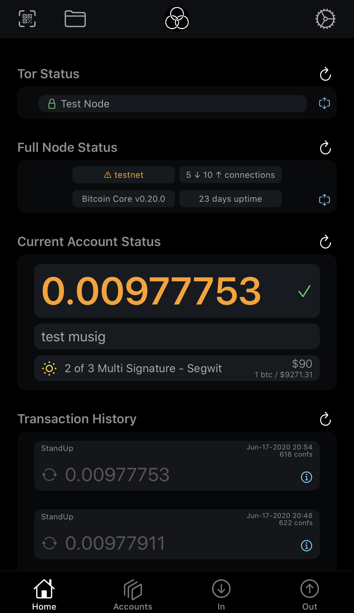
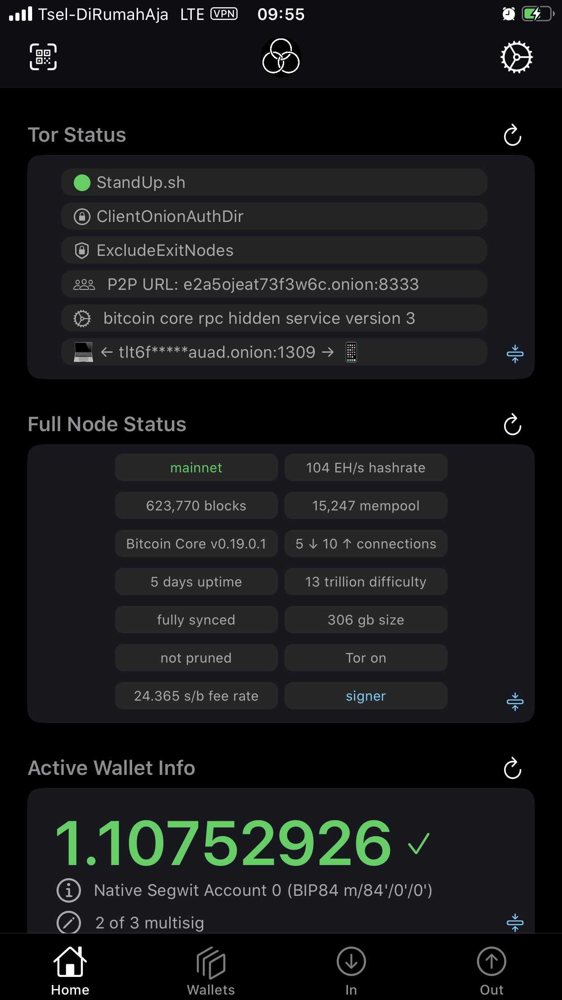

# GordianWallet-iOS

*(Previously known as FullyNoded-2)*

 

**_GordianWallet-iOS_** is an open source iOS Bitcoin wallet that connects via Tor V3 authenticated service to the full node of your choice, including: a bitcoind installed using either [GordianServer-macOS](https://github.com/BlockchainCommons/GordianServer-macOS) or another Bitcoin Standup program such as [Linux Scripts](https://github.com/BlockchainCommons/Bitcoin-StandUp-Scripts); a full-node box such as [Nodl](https://www.nodl.it/) or [Rasbiblitz](https://github.com/rootzoll/raspiblitz); or a full-node service such as [BTCpay](https://btcpayserver.org/]). *GordianWallet* is a self-sovereign wallet, and self-sovereignty means that you get to decide.

*GordianWallet* allows for multiple wallet templates, including: legacy, SegWit-compatible, and SegWit-native hot wallets using a single signature (seed on iOS device); a warm wallet using multisig (seed on iOS device, keys on full node, offline seed, etc.); or a number of cold wallet templates that leverage PSBTs (Partially Signed Bitcoin Transactions), such as cold offline seeds, third-party collaborative custody services, and various air-gapped hardware solutions using QR codes. *GordianWallet* can potentially support almost anything that can be described by a [bitcoind descriptor](https://github.com/bitcoin/bitcoin/blob/master/doc/descriptors.md).

*GordianWallet-iOS* is part of the [Gordian system](https://github.com/BlockchainCommons/Gordian).

 

## Status — Early Beta

*GordianWallet* is currently under active development and in early beta testing phase. It should be used on Bitcoin testnet to gain familiarity with how the wallet works, and most importantly to practice deleting and recovering wallet. For a detailed checklist to test critical functionality please see our [Testing Checklist.md](./Docs/Testing Checklist.md)

## Installing Gordian Wallet

*GordianWallet* can be easily installed using Testflight, but if you prefer you can also install from source.

To install from source:

* `$ git clone https://github.com/BlockchainCommons/GordianWallet-iOS`
* `$ cd GordianWallet-iOS/XCode`
* double click `GordianWallet.xcodeproj`

You can then run the app either on your mac, iPhone or a simulator.

Please only use the app on testnet!

To help us improve *GordianWallet*, *please*  share crash reports and give us feedback. Want a feature added? Tell us about it.

### Requirements

- iOS 13
- A Bitcoin Core full node v0.20.0 (at minimum) which is running on Tor with `rpcport` exposed to a Tor V3 hidden service, such as a [GordianServer-macOS](https://github.com/BlockchainCommons/GordianServer-macOS) or one created by the Bitcoin Standup [Linux Scripts](https://github.com/BlockchainCommons/Bitcoin-StandUp-Scripts). Your node does not need to be an archive node, thus you can save space by being setup as a pruned full node.

### Installing GordianWallet from Testflight

We have a public Testflight link available for beta testing [here](https://testflight.apple.com/join/OQHyL0a8).

Click through, and you'll be able to install the app immediately (and will be instructed how to install Testflight if you need to do so first).

### Installing GordianWallet from Source

Full instruction on installing from source are available [here](Docs/Install-from-source.md).

### Linking to a Full Node

When you install *GordianWallet*, you will need to link it to the full node of your choice.

*Gordian Wallet*  has been tested with [GordianServer-macOS](https://github.com/BlockchainCommons/Bitcoin-StandUp-MacOS) and with our Bitcoin Standup [Linux scripts](https://github.com/BlockchainCommons/Bitcoin-StandUp-Scripts), which install your own personal bitcoin-core and Tor services.

*GordianWallet* should also work with any properly configured Bitcoin Core 0.20.0 node with a hidden service controlling `rpcport` via localhost, including full node devices such as [Nodl](https://www.nodl.it/) or [RaspiBlitz](https://github.com/rootzoll/raspiblitz), or full nodes installed by other services such as [BTCPayServer](https://btcpayserver.org). These full nodes can be connected by clicking a link or scanning a QR code.

Please refer to their telegram groups for simple instructions on linking to these servers or services:

- [Nodl Telegram](https://t.me/nodl_support)
- [RaspiBlitz Telegram](https://t.me/raspiblitz)
- [BTCPayServer Telegram](https://t.me/btcpayserver)

## Using GordianWallet

Please see our [features](Docs/Features.md) document for full information on how to use Gordian Wallet once it's installed.

Afterward, you may also want to read about [how it all works](Docs/How-it-works.md).

## The Philosophy Behind GordianWallet

*GordianWallet* is a professional mobile wallet built using the most up-to-date technologies for Bitcoin. It's focused on three goals that together demonstrate some of the best practices for modern mobile-wallet design:

1. **Self-sovereign Interactions.** Classic mobile wallets usually talked to a full node chosen by the wallet developer and owned/controlled by someone else. *GordianWallet* instead allows you to choose a full node, either one created using a setup process such as #BitcoinStandup and run by yourself, or a service offered by a provider that you select: self-sovereign means you get to decide. (You can use Blockchain Commons' full-node server for beta testing, but you should migrate to a protected server for real money transactions.)

2. **Protected Communications.** All of the communications in *GordianWallet* are protected by the latest version of Tor, which provides two-way authentication of both the server and your wallet. Unlike traditional use of the soon-to-be-deprecated SPV protocol, which reveals that you're accessing the Bitcoin network, Tor simply shows that you're engaging in private onion communications. It's safer when you're in a hostile state, and it's safer in your local coffee shop.

3. **Multi-sig Protections.** Finally, *GordianWallet* ensures that your private keys are protected from the most common adversary: loss. Its 2-of-3 multi-sig system leaves one key on the server, one on your mobile wallet, and one in safe off-line storage. If you lose your phone or your server, you can still rebuild from the other two. (The Blockchain Commons [#SmartCustody](https://github.com/BlockchainCommons/SmartCustodyBook) system talks more about how to protect off-line keys.)

*GordianWallet* is intended for a sophisticated power user. It's a leading-edge platform that experiments with modern Bitcoin technologies to create a powerful new architecture with features not found in other mobile wallets. It's intended as a professional wallet for your use and also as a demonstration of functionality that other companies can integrate into their own apps as an open source reference implementation of functionality.

Even more cutting-edge technology is planned for the future, including collaborative custody models, airgapped technologies such as Blockchain Commons' #LetheKit for offline signing using QR codes, and methodologies for social-key recovery.

## Origin, Authors, Copyright & Licenses

Unless otherwise noted (either in this [/README.md](./README.md) or in the file's header comments) the contents of this repository are Copyright © 2020 by Blockchain Commons, LLC, and are [licensed](./LICENSE) under the [spdx:BSD-2-Clause Plus Patent License](https://spdx.org/licenses/BSD-2-Clause-Patent.html).

In most cases, the authors, copyright, and license for each file reside in header comments in the source code. When it does not, we have attempted to attribute it accurately in the table below.

This table below also establishes provenance (repository of origin, permalink, and commit id) for files included from repositories that are outside of this repo. Contributors to these files are listed in the commit history for each repository, first with changes found in the commit history of this repo, then in changes in the commit history of their repo of their origin.

| File                                        | From                                                         | Commit                                                       | Authors & Copyright (c) | License                              |
| ------------------------------------------- | ------------------------------------------------------------ | ------------------------------------------------------------ | ----------------------- | ------------------------------------ |
| TBW                                         | TBW                                                          | TBW                                                          | TBW                     | TBW                                  |
| exception-to-the-rule.c or exception-folder | [https://github.com/community/repo-name/PERMALINK](https://github.com/community/repo-name/PERMALINK) | [https://github.com/community/repo-name/commit/COMMITHASH]() | 2020 Exception Author   | [MIT](https://spdx.org/licenses/MIT) |

### Dependencies

- [Tor.framework](https://github.com/iCepa/Tor.framework) by the [iCepa project](https://github.com/iCepa) - for communicating with your nodes hidden service
- [LibWally-Swift](https://github.com/blockchain/libwally-swift) built by [@Sjors](https://github.com/Sjors) - for BIP39 mnemonic creation and HD key derivation
- [Base32](https://github.com/norio-nomura/Base32/blob/master/Sources/Base32) built by [@norio-nomura](https://github.com/norio-nomura) - for Tor V3 authentication key encoding

## Financial Support

*Gordian Wallet* is a project of [Blockchain Commons](https://www.blockchaincommons.com/). We are proudly a "not-for-profit" social benefit corporation committed to open source & open development. Our work is funded entirely by donations and collaborative partnerships with people like you. Every contribution will be spent on building open tools, technologies, and techniques that sustain and advance blockchain and internet security infrastructure and promote an open web.

To financially support further development of *Gordian Wallet* and other projects, please consider becoming a Patron of Blockchain Commons through ongoing monthly patronage as a [GitHub Sponsor](https://github.com/sponsors/BlockchainCommons). You can also support Blockchain Commons with bitcoins at our [BTCPay Server](https://btcpay.blockchaincommons.com/).

### Project Sponsors

Thanks to our project sponsors for their support of *Gordian Wallet*:

**[Blockchainbird](https://github.com/blockchainbird/bird)** is a free and open source software toolset with a manual to build an extra guarantee layer on existing database systems. It is free to use and adapt to your own needs. Smartphones and smart custody arranged? Then Bird gives wings to projects that are labeled as blockchain, but can in fact be implemented with databases.

## Contributing

We encourage public contributions through issues and pull-requests! Please review [CONTRIBUTING.md](./Docs/CONTRIBUTING.md) for details on our development process. All contributions to this repository require a GPG signed [Contributor License Agreement](./Docs/CLA.md).

### Discussions

The best place to talk about Blockchain Commons and its projects is in our GitHub Discussions areas.

[**Gordian System Discussions**](https://github.com/BlockchainCommons/Gordian/discussions). For users and developers of the Gordian system, including the Gordian Server, Bitcoin Standup technology, QuickConnect, and the Gordian Wallet. If you want to talk about our linked full-node and wallet technology, suggest new additions to our Bitcoin Standup standards, or discuss the implementation our standalone wallet, the Discussions area of the [main Gordian repo](https://github.com/BlockchainCommons/Gordian) is the place.

[**Blockchain Commons Discussions**](https://github.com/BlockchainCommons/Community/discussions). For developers, interns, and patrons of Blockchain Commons, please use the discussions area of the [Community repo](https://github.com/BlockchainCommons/Community) to talk about general Blockchain Commons issues, the intern program, or topics other than the [Gordian System](https://github.com/BlockchainCommons/Gordian/discussions) or the [wallet standards](https://github.com/BlockchainCommons/AirgappedSigning/discussions), each of which have their own discussion areas.

### Other Questions & Problems

As an open-source, open-development community, Blockchain Commons does not have the resources to provide direct support of our projects. Please consider the discussions area as a locale where you might get answers to questions. Alternatively, please use this repository's [issues](./issues) feature. Unfortunately, we can not make any promises on response time.

If your company requires support to use our projects, please feel free to contact us directly about options. We may be able to offer you a contract for support from one of our contributors, or we might be able to point you to another entity who can offer the contractual support that you need.

### Credits

*GordianWallet* is a professional mobile wallet that can be used by you for your cryptocurrency needs, but it's also an example that shows the latest in wallet technology and that can be used to inspire your own wallet designs, per the license above.

The team responsible for designing and developing this app are:

**Christopher Allen, Principal Architect.** Christopher has been working on open web architectures since the early ’90s, with a focus on security, privacy, cryptography, and standards. He is the founder of [Blockchain Commons](https://www.blockchaincommons.com/) and [Rebooting the Web of Trust](https://www.weboftrust.info/) and a member of the [W3 Credentials Community Group](https://w3c-ccg.github.io/). His recent focus is on engines of trust, specifically blockchains, digital assets, smart contracts, smart signatures, and decentralized self-sovereign identity..

**Peter Denton, Project Lead.** Creator of [Fully Noded](https://apps.apple.com/us/app/fully-noded/id1436425586). Tor and Bitcoin enthusiast who is passionate about building censorship resistant, user empowering Bitcoin software to promote self sovereignty.

You can contact them at:

| Name              | Role                | Github                                            | Email                                 | GPG Fingerprint                                    |
| ----------------- | ------------------- | ------------------------------------------------- | ------------------------------------- | -------------------------------------------------- |
| Christopher Allen | Principal Architect | [@ChristopherA](https://github.com/ChristopherA) | \<ChristopherA@LifeWithAlacrity.com\> | FDFE 14A5 4ECB 30FC 5D22  74EF F8D3 6C91 3574 05ED |
| Peter Denton      | Project Lead        | [@Fonta1n3](https://github.com/Fonta1n3)                                      | \<fontainedenton@googlemail.com\>     | 3B37 97FA 0AE8 4BE5 B440  6591 8564 01D7 121C 32FC |

You can add your name here by getting involved — the first step is to learn how to contribute from our [CONTRIBUTING.md](./CONTRIBUTING.md) documentation.

## Responsible Disclosure

We want to keep all our software safe for everyone. If you have discovered a security vulnerability, we appreciate your help in disclosing it to us in a responsible manner. We are unfortunately not able to offer bug bounties at this time.

We do ask that you offer us good faith and use best efforts not to leak information or harm any user, their data, or our developer community. Please give us a reasonable amount of time to fix the issue before you publish it. Do not defraud our users or us in the process of discovery. We promise not to bring legal action against researchers who point out a problem provided they do their best to follow the these guidelines.

### Reporting a Vulnerability

Please report suspected security vulnerabilities in private via email to ChristopherA@LifeWithAlacrity.com (do not use this email for support). Please do NOT create publicly viewable issues for suspected security vulnerabilities.

The following keys may be used to communicate sensitive information to developers:

| Name              | Fingerprint                                        |
| ----------------- | -------------------------------------------------- |
| Christopher Allen | FDFE 14A5 4ECB 30FC 5D22  74EF F8D3 6C91 3574 05ED |

You can import a key by running the following command with that individual’s fingerprint: `gpg --recv-keys "<fingerprint>"` Ensure that you put quotes around fingerprints that contain spaces.
